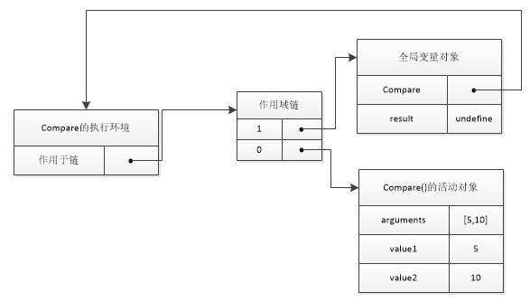

# js闭包 #

   闭包是指有权访问另一个函数作用域的变量的函数，创建闭包最常用的方法就是在一个函数内部创建另一个函数

## 首先理解函数被调用的时候会发生什么 ##
   举个例子：

     function compare(value1,value2){
        if(value1<value2){
           return -1;
        }
       else if(value1>value2){
           return 1;
       }else{
          return 0;   
      }
    }

   当某个函数被调用时，会创建一个执行环境及相应的作用域链。然后，使用后arguments和其他命名参数的值来初始化活动对象。但在作用域链中外部函数的活动对象始终处于第二位，如下图所示：

   

   全局变量的对象始终存在，在函数被调用的时候活动对象被创建并推入执行环境作用域链的最前端，函数访问一个变量的时候就会在作用域链中搜索相应名字的变量，一般来讲，在函数执行完毕时局部活动对象就会被销毁。

## 闭包 ##
在一个函数的内部定义的函数会将包含函数的活动对象添加到他的作用域链中。因此，在外部函数内部定义的匿名函数的作用域链中，实际上会包含外部函数的活动对象所以在外部函数执行完毕后活动对象不会被销毁，知道内部函数执行完毕后才会被销毁

## 闭包与变量 ##
   之前做的一个面试题

    function createFunctions(){
         var result=new Array();
         for(var i=0;i<10;i++){
            result[i]=function(){
               return i;
           }
      }
       return result;
    }

   每个函数返回的都是10为什么？

  理解了闭包那么这个就很简单了，是个函数共享了外部函数的变量i，也就是说是个内部函数都只是指向了外部函数的i变量，所以每个函数都只会取到变量i的最终结果10。知道所有的内部函数执行完毕i才会被销毁。

  修改如下：
   
    function createFunctions(){
         var result=new Array();
         for(var i=0;i<10;i++){
            result[i]=function(num){
               return function(){return num};
           }(i)
      }
       return result;
    }

  这样每个函数都有一个自己num变量的副本